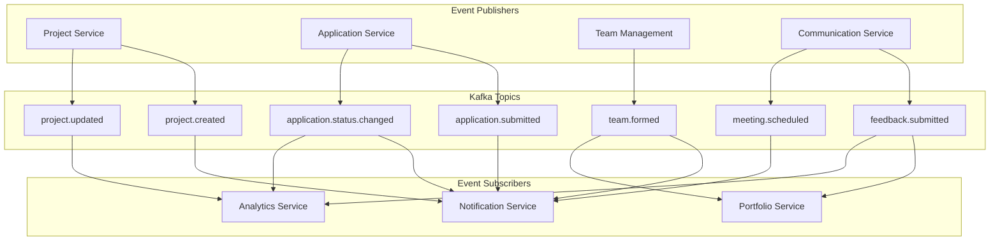
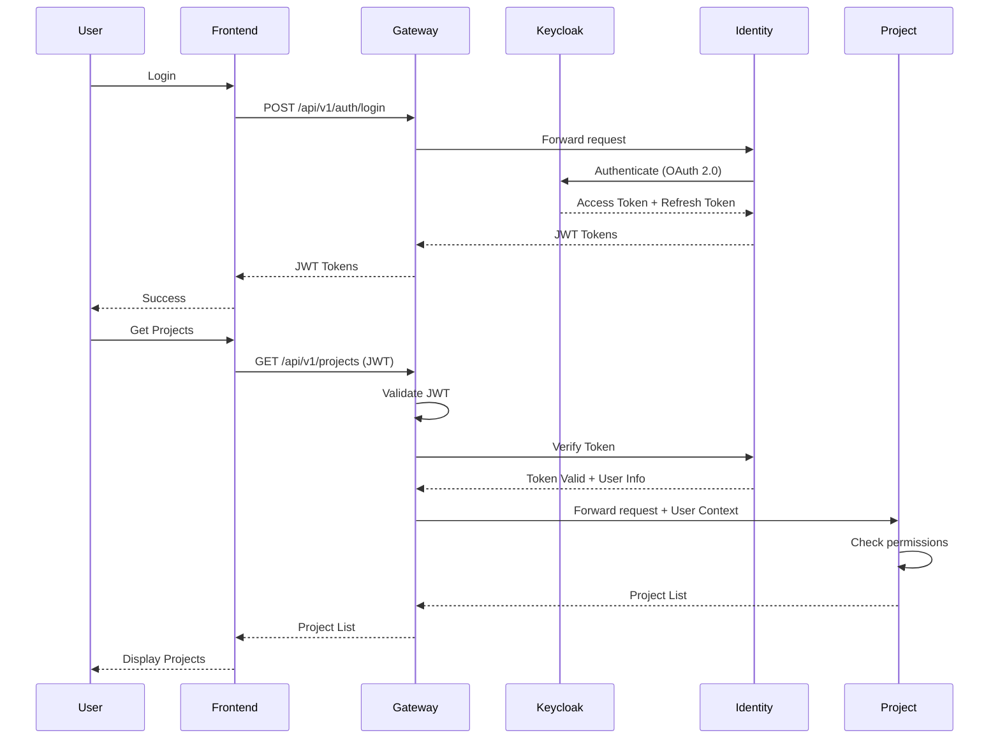
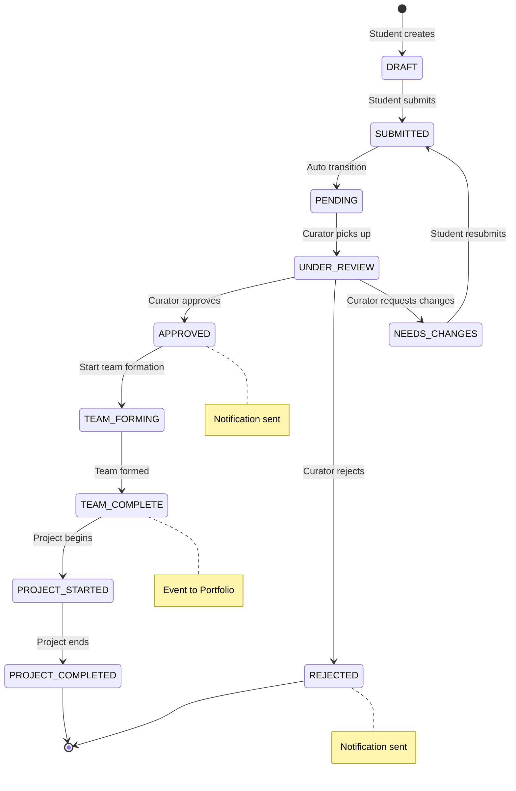
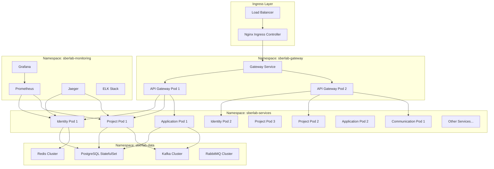
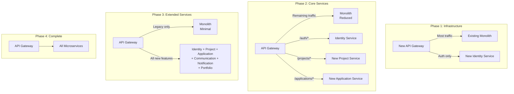
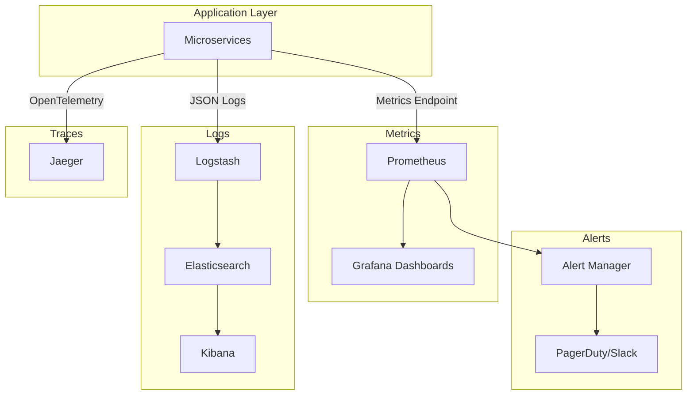

# Архитектурные схемы SberLab-NSU

## 1. Общая архитектура микросервисов

```mermaid
graph TB
    subgraph "Client Layer"
        Frontend[React Frontend<br/>TypeScript]
    end
    
    subgraph "Infrastructure Layer"
        Gateway[API Gateway<br/>Kong/Spring Cloud Gateway]
        Discovery[Service Discovery<br/>Consul/Eureka]
        Config[Config Server<br/>Spring Cloud Config]
    end
    
    subgraph "Business Microservices"
        Identity[Identity Service<br/>Auth & Users]
        Project[Project Service<br/>Projects & Templates]
        Application[Application Service<br/>Applications & Teams]
        Communication[Communication Service<br/>Q&A, Meetings, Feedback]
        Notification[Notification Service<br/>Email & In-app]
        Portfolio[Portfolio Service<br/>Skills & Achievements]
        Analytics[Analytics Service<br/>Metrics & Reports]
        Integration[Integration Service<br/>Git, Jira, Wiki]
    end
    
    subgraph "External Systems"
        Keycloak[Keycloak SSO<br/>OAuth 2.0]
        Git[GitHub/GitLab]
        TaskTracker[Jira/YouTrack]
        Wiki[Confluence/Notion]
    end
    
    subgraph "Data Layer"
        PG1[(PostgreSQL<br/>Identity DB)]
        PG2[(PostgreSQL<br/>Project DB)]
        PG3[(PostgreSQL<br/>Application DB)]
        PG4[(PostgreSQL<br/>Communication DB)]
        PG5[(PostgreSQL<br/>Notification DB)]
        PG6[(PostgreSQL<br/>Portfolio DB)]
        PG7[(ClickHouse<br/>Analytics DB)]
        PG8[(PostgreSQL<br/>Integration DB)]
        Redis[(Redis<br/>Cache & Sessions)]
        ES[(Elasticsearch<br/>Search)]
    end
    
    subgraph "Message Brokers"
        Kafka[Apache Kafka<br/>Event Streaming]
        RabbitMQ[RabbitMQ<br/>Real-time Messages]
    end
    
    subgraph "Storage"
        MinIO[MinIO/S3<br/>File Storage]
    end
    
    Frontend --> Gateway
    Gateway --> Discovery
    Gateway --> Identity
    Gateway --> Project
    Gateway --> Application
    Gateway --> Communication
    Gateway --> Notification
    Gateway --> Portfolio
    Gateway --> Analytics
    Gateway --> Integration
    Gateway --> MinIO
    
    Identity --> Keycloak
    Identity --> PG1
    Project --> PG2
    Application --> PG3
    Communication --> PG4
    Notification --> PG5
    Portfolio --> PG6
    Portfolio --> ES
    Analytics --> PG7
    Integration --> PG8
    
    Identity --> Redis
    Project --> Redis
    Application --> Redis
    
    Project --> Kafka
    Application --> Kafka
    Communication --> Kafka
    
    Notification --> RabbitMQ
    Communication --> RabbitMQ
    
    Integration --> Git
    Integration --> TaskTracker
    Integration --> Wiki
    
    Discovery --> Identity
    Discovery --> Project
    Discovery --> Application
    Discovery --> Communication
    Discovery --> Notification
    Discovery --> Portfolio
    Discovery --> Analytics
    Discovery --> Integration
    
    Config --> Identity
    Config --> Project
    Config --> Application
    Config --> Communication
    Config --> Notification
    Config --> Portfolio
    Config --> Analytics
    Config --> Integration
```



## 2. Межсервисная коммуникация

```mermaid
graph LR
    subgraph "Синхронная коммуникация (REST)"
        Identity[Identity Service]
        Project[Project Service]
        Application[Application Service]
        Portfolio[Portfolio Service]
        
        Application -->|GET /projects/{id}| Project
        Application -->|GET /users/{id}| Identity
        Portfolio -->|GET /applications| Application
        Project -->|Validate JWT| Identity
    end
    
    subgraph "Асинхронная коммуникация (Kafka Events)"
        Kafka[Apache Kafka]
        
        Project2[Project Service] -->|project.created| Kafka
        Application2[Application Service] -->|application.status.changed| Kafka
        Application2 -->|team.formed| Kafka
        Communication2[Communication Service] -->|feedback.submitted| Kafka
        
        Kafka -->|Subscribe| Notification[Notification Service]
        Kafka -->|Subscribe| Analytics[Analytics Service]
        Kafka -->|Subscribe| Portfolio2[Portfolio Service]
    end
    
    subgraph "Real-time коммуникация (RabbitMQ)"
        RabbitMQ[RabbitMQ]
        
        Notification2[Notification Service] -->|Email Queue| RabbitMQ
        Communication3[Communication Service] -->|Real-time Notifications| RabbitMQ
        RabbitMQ -->|WebSocket| Gateway[API Gateway]
    end
```

## 3. Kafka Topics и Event Flow



## 4. Database per Service Pattern

```mermaid
graph TB
    subgraph "Identity Service"
        IS[Identity Service] --> ISPG[(PostgreSQL<br/>users, roles,<br/>permissions)]
        IS --> RedisI[(Redis<br/>user cache)]
    end
    
    subgraph "Project Service"
        PS[Project Service] --> PSPG[(PostgreSQL<br/>projects, templates,<br/>tags)]
        PS --> RedisP[(Redis<br/>project cache)]
    end
    
    subgraph "Application Service"
        AS[Application Service] --> ASPG[(PostgreSQL<br/>applications,<br/>teams, history)]
    end
    
    subgraph "Communication Service"
        CS[Communication Service] --> CSPG[(PostgreSQL<br/>questions, meetings,<br/>feedback)]
    end
    
    subgraph "Notification Service"
        NS[Notification Service] --> NSPG[(PostgreSQL<br/>notifications,<br/>templates)]
    end
    
    subgraph "Portfolio Service"
        POS[Portfolio Service] --> POSPG[(PostgreSQL<br/>portfolio, skills,<br/>achievements)]
        POS --> ES[(Elasticsearch<br/>skills search)]
    end
    
    subgraph "Analytics Service"
        ANS[Analytics Service] --> CH[(ClickHouse<br/>metrics,<br/>time series)]
    end
    
    subgraph "Integration Service"
        INS[Integration Service] --> INSPG[(PostgreSQL<br/>integrations,<br/>webhooks)]
    end
```



## 5. Authentication & Authorization Flow



## 6. Application Workflow (State Machine)



## 7. Deployment Architecture (Kubernetes)



## 8. CI/CD Pipeline

```mermaid
graph LR
    subgraph "Source Code"
        Git[GitLab/GitHub]
    end
    
    subgraph "Build Stage"
        Maven[Maven Build]
        Tests[Unit Tests]
        SonarQube[SonarQube Analysis]
    end
    
    subgraph "Containerization"
        Docker[Docker Build]
        Registry[Container Registry]
    end
    
    subgraph "Deployment"
        ArgoCD[ArgoCD GitOps]
        K8s[Kubernetes Cluster]
    end
    
    subgraph "Monitoring"
        Prometheus[Prometheus]
        Grafana[Grafana]
    end
    
    Git -->|git push| Maven
    Maven --> Tests
    Tests --> SonarQube
    SonarQube -->|Quality Gate| Docker
    Docker --> Registry
    Registry --> ArgoCD
    ArgoCD -->|Deploy| K8s
    K8s --> Prometheus
    Prometheus --> Grafana
```



## 9. Migration Strategy (Strangler Fig Pattern)



## 10. Monitoring & Observability Stack



---

## Легенда

### Типы связей
- **Сплошная линия** → Синхронный вызов (REST API)
- **Пунктирная линия** → Асинхронная коммуникация (Events)
- **Толстая линия** → Основной flow данных

### Компоненты
- **Прямоугольник** → Сервис/Приложение
- **Цилиндр** → База данных
- **Параллелограмм** → Очередь/Брокер
- **Облако** → Внешний сервис

### Цвета (в Mermaid)
- **Синий** → Infrastructure Layer
- **Зеленый** → Business Services
- **Оранжевый** → Data Layer
- **Фиолетовый** → External Systems
